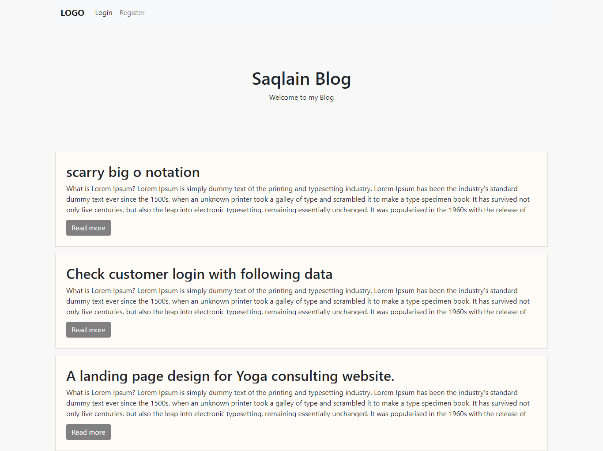
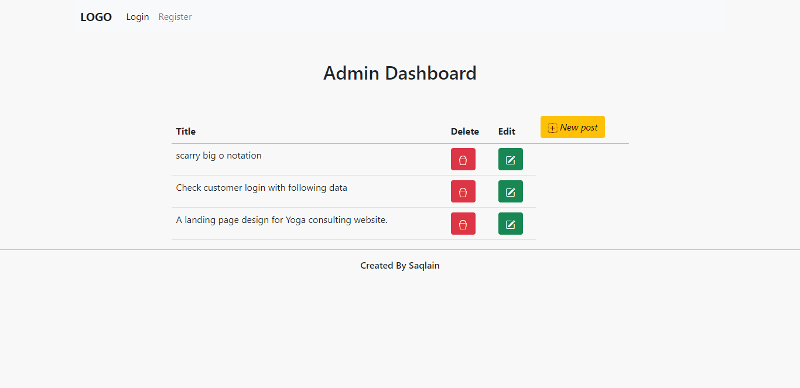
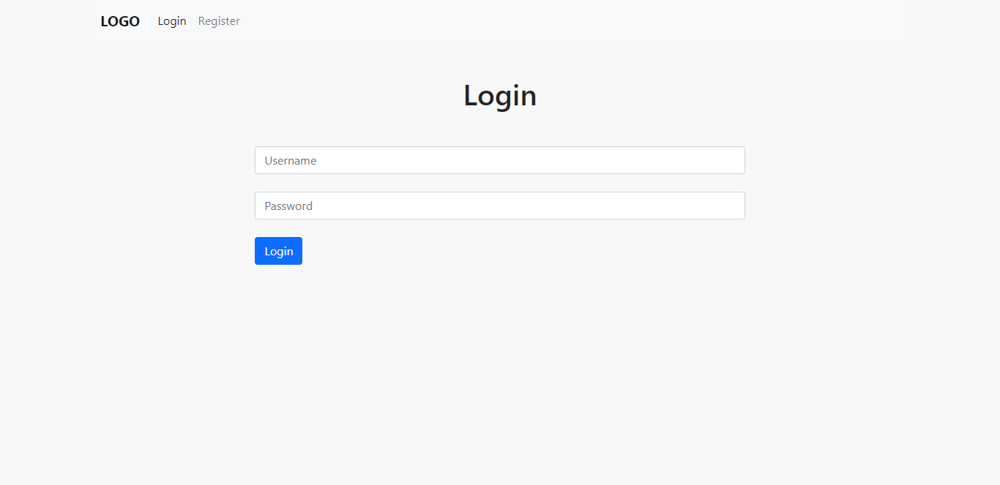
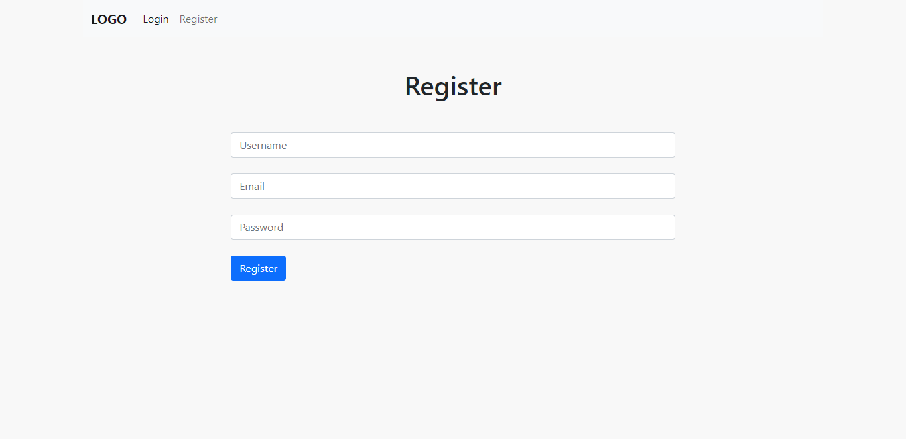

# Blogpost App

> Main objective was to create a blog writing plateform, where anyone can view the blogs and online admin have a right to edit, delete or create the posts.
> The main purpose was to get the hands on experience while working with many technologies at a same time.

## Technologies used

---

- Node JS
- Express JS
- PostgreSQL
- React JS
- React Hooks
- Bootstrap
- Bcrypt (for encrypting password)
- Knex (To access database easily)

---

## Achieved

- User login
- Role based Autorization
- CRUD based system
- Database connections with server

## Screenshots

---

> #### Home Page

> #### Admin Dashboard

> #### Login and Register page

